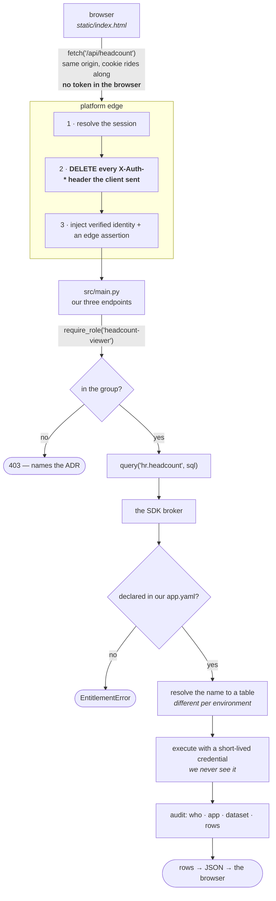
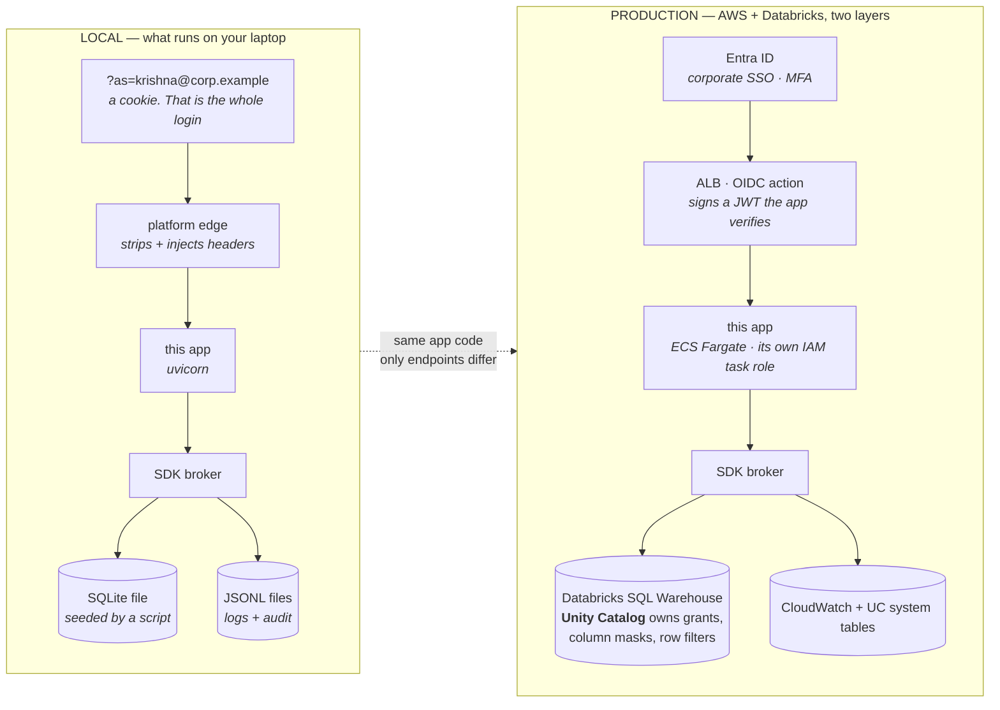
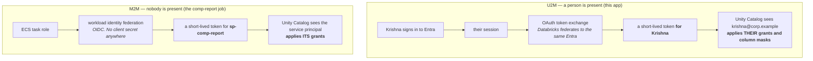

# headcount-dashboard

An interactive web app on [Insights Hub](https://github.com/KRISHNABR/insights-platform), owned
by **people-ops**. Shows headcount by department, and looks people up in the internal directory.

It exists to prove the consumption model, so it is deliberately trivial. **The interesting thing
about this repo is how little is in it.**

---

## What we wrote, and what we got

| We wrote | Lines |
|---|---|
| [`src/main.py`](src/main.py) — three JSON endpoints | ~45 |
| [`static/index.html`](static/index.html) — the frontend | ~70 |
| [`app.yaml`](app.yaml) — our contract with the platform | ~90, mostly comments |

| We inherited, and wrote none of | |
|---|---|
| Corporate sign-in, sessions, group membership | |
| Permission checks (`require_role`) | |
| Data access — no connection, no credential, no table name | |
| Structured logs, metrics, audit records | |
| `/healthz`, which resolves every dataset we declared | |
| The container image | |
| Four CI/CD pipelines across three environments | |

There is **no Dockerfile, no pipeline code, no auth code and no connection string** in this
repository. That is the platform's value proposition, stated as a file listing.

---

## Setup

```bash
# 1 · get all four repos side by side (the local loop finds siblings by name)
mkdir insights-hub && cd insights-hub
for r in insights-platform insights-sdk insights-headcount-dashboard insights-comp-report; do
  git clone "https://github.com/KRISHNABR/$r.git"
done

# 2 · start the whole platform
cd insights-platform && uv run insights up          # add --port 9100 if 8080 is taken

# 3 · sign in. Appending ?as= is the entire local login
open "http://localhost:8080/a/headcount-dashboard/?as=krishna@corp.example"
```

Needs Python 3.12 and [uv](https://docs.astral.sh/uv/). No Docker, no cloud account.

### Working on this app

```bash
uv sync                      # install
uv run insights doctor       # everything CI will check, checked locally — same code path
uv run insights datasets     # what data we can read, and what we could request
uv run insights build --show # the exact container image the platform will build for us
```

### The users you can sign in as

| User | Groups | What you'll see |
|---|---|---|
| `krishna@corp.example` | `MG-PEOPLE-OPS`, `headcount-viewer` | Everything — she holds the role |
| `vidya@corp.example` | `MG-PEOPLE-ANALYTICS`, `comp-analyst` | **403.** Signed in, but not a `headcount-viewer` |
| `suraj@corp.example` | `MG-PLATFORM` | **403.** Platform team has no special access to tenant apps |

That middle row is the useful one: authentication and authorization are different questions.

---

## How a request actually works



**Three things in that diagram are the whole design:**

- **Step 2.** If the edge did not strip client headers, `curl -H "X-Auth-Groups: comp-analyst"`
  would be a complete bypass and our app could not tell. Try it — you stay Krishna.
- **No token in the browser.** The frontend is served from the same origin as the API, so the
  session cookie is attached automatically. There is no access token in `localStorage` for an
  XSS bug to steal, because there is no access token at all.
- **`hr.headcount` is a name, not a table.** We never learn the physical table, which is why
  this same code runs in dev, uat and prod unchanged.

---

## Our contract — [`app.yaml`](app.yaml)

The two `access` blocks answer different questions, and keeping them apart is the point:

```yaml
access:
  manage:                                  # who may DEPLOY and GOVERN this app
    owners:       [MG-PEOPLE-OPS]          #   approve prod · request data · answer for it
    contributors: [MG-PEOPLE-OPS-ENG]      #   deploy dev/uat · read logs · NOT prod
    readers:      [MG-FINANCE-BI]          #   see status and telemetry only
  roles:                                   # who may USE the running app
    - name: headcount-viewer
      groups: [MG-PEOPLE-OPS, MG-FINANCE-BI]

data:                                      # what we may read. Names, never tables
  - {dataset: hr.headcount,     access: read}
  - {dataset: directory.people, access: read}   # a different connection — same declaration
```

An engineer who can ship to uat is not thereby allowed to read what the app reads. A person who
can view the dashboard cannot deploy it.

**What we cannot write here:** `classification`, `connection`, `engine`, `credential`, `dsn`,
`table`, `host`. The manifest loader rejects all of them at any depth. We declare *intent*; the
platform decides *mechanism*.

---

## Deploying

Four generated workflows, four lines each:

| Workflow | When | Approved by |
|---|---|---|
| `ci.yml` | every PR | nobody — it deploys nothing |
| `deploy-dev.yml` | merge to main | nobody. That is what dev is for |
| `deploy-uat.yml` | we click Run | our **contributors** |
| `deploy-prod.yml` | we click Run | our **owners** |

The image is built **once, in dev**. uat and prod promote that exact image — they never rebuild,
because a rebuild in prod means prod is running something nobody tested. And we cannot give
ourselves a production deploy: the approver lists come from `access.manage`, not from our
workflow files.

---

## Local vs production — the same app, two very different worlds

Everything on the left is a fake. **Nothing in `src/` changes between them.**



### What changes, precisely

| Concern | Local | Production | Changes in `src/` |
|---|---|---|---|
| **SSO** | `?as=` sets a cookie | Entra ID via the ALB's OIDC action | nothing |
| **U2M** — a person reading data | the app reads for you | **token exchange**: your session becomes a short-lived Databricks token, so Unity Catalog sees *you* and applies *your* masks | nothing |
| **M2M** — a job reading data | the app's own identity | **workload identity federation** from the ECS task role. No client secret exists | nothing |
| **Shared connections** | SQLite + a stdlib REST stub | Databricks SQL Warehouse + the real service over PrivateLink | nothing |
| **Access to data** | our `app.yaml` + `grants.yaml` | our `app.yaml` + **a Unity Catalog grant**, enforced by the data platform on every path including notebooks | nothing |
| **Who holds the password** | an env var the CLI injects | **nobody — there is no stored credential** | nothing |
| **Audit** | a JSONL file | UC `system.access.audit` is authoritative; our record correlates it to the app and HTTP request | nothing |

### U2M and M2M, side by side

The distinction that matters most, because it decides what Unity Catalog sees:



**Why this matters for the platform team's own access:** neither path leaves a credential
anywhere. There is nothing in a secret store for a platform engineer to read, and no standing
identity to impersonate. To see tenant rows they need a Unity Catalog grant from the data owner,
recorded in UC's audit, which the platform team cannot edit.

---

*Start at the [platform README](https://github.com/KRISHNABR/insights-platform), then
[ONBOARDING.md](https://github.com/KRISHNABR/insights-platform/blob/main/ONBOARDING.md).*
